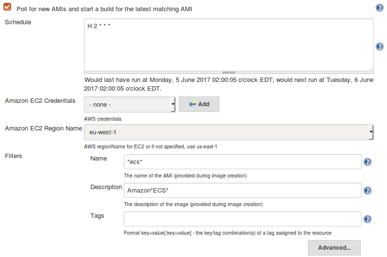
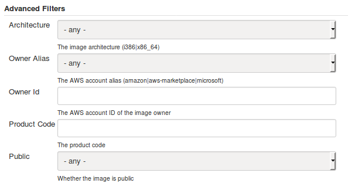
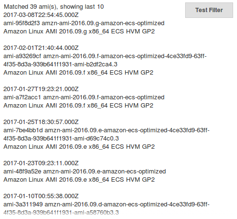

# aws-ami-trigger
A Jenkins plugin to poll for new AMIs and trigger a build for the latest matching AMI.

## Overview
This plugin uses the [AWS EC2 DecribeImages](https://docs.aws.amazon.com/AWSEC2/latest/APIReference/API_DescribeImages.html) service
to find matching AMIs.

The following filters are supported:

  * `name` - The name of the AMI (provided during image creation - supports wildcards)
  * `description` - The description of the image (provided during image creation - supports wildcards)
  * `tags` (key=value) - The key/value combination of a tag assigned to the resource

The following advanced attributes are also supported:
  * `architecture` - the image architecture (`i386` | `x86_64`)
  * `is-public` - a boolean that indicates whether the image is public
  * `owner-alias` - string value from an Amazon-maintained list (`amazon` | `aws-marketplace` | `microsoft`) of snapshot owners
  * `owner-id` - the AWS account ID of the image owner
  * `product-code` - the product code

(Note that `state` is always set to `available`).

## Configuration

The filters are configured on the build configuration page:

  * **Schedule** - a cron style schedule for the trigger
  * **Amazon EC2 Credentials** - the id of credentials added via the [AWS Credentials Plugin](https://plugins.jenkins.io/aws-credentials)
  * **Amazon EC2 Region Name** - the region name to search for AMIs (defaults to `us-east-1`)
  * **Name** - the name of the AMI
  * **Description** - the description of the AMI
  * **Tags** - tags for the AMI in the form `key=value[;key=value]`, for example `Project=Awesome;Role=Web`

Note that at least one of **Name**, **Description** or **Tags** must be specified to prevent the filter fetching too many AMIs.

Advanced filters may also be specified:

  * **Architecture** - the image architecture (`i386` | `x86_64`)
  * **Owner Alias** - value from an Amazon-maintained list (`amazon` | `aws-marketplace` | `microsoft`) of snapshot owners
  * **Owner Id** - the AWS account ID of the image owner
  * **Product Code** - the product code
  * **Public** - a boolean that indicates whether the image is public

Click **Test Filter** to test the filter before saving. This displays the number of AMIs currently matching the filter and the top 10
matches. It displays the following attributes of those images: `creation-date`, `image-id`, `name` and `description`.

Click **Add** to add more filters. *Note that a build may be scheduled for each filter - if there is a new AMI matching each filter then
a build will be scheduled for each one.*

## Environment variables

envVars.put("awsAmiTriggerImageArchitecture", cause.getImage().getArchitecture());
envVars.put("awsAmiTriggerImageCreationDate", cause.getImage().getCreationDate());
envVars.put("awsAmiTriggerImageDescription", cause.getImage().getDescription());
envVars.put("awsAmiTriggerImageHypervisor", cause.getImage().getHypervisor());
envVars.put("awsAmiTriggerImageId", cause.getImage().getImageId());
envVars.put("awsAmiTriggerImageType", cause.getImage().getImageType());
envVars.put("awsAmiTriggerImageName", cause.getImage().getName());
envVars.put("awsAmiTriggerOwnerId", cause.getImage().getOwnerId());

For each build triggered the following environment variables are set:

  * `awsAmiTriggerImageArchitecture` - the image architecture (`i386` | `x86_64`)
  * `awsAmiTriggerImageCreationDate` - the date and time the image was created
  * `awsAmiTriggerImageDescription` - the description of the AMI that was provided during image creation
  * `awsAmiTriggerImageHypervisor` - the hypervisor type of the image (`ovm` | `xen`)
  * `awsAmiTriggerImageId` - the ID of the AMI
  * `awsAmiTriggerImageType` - the type of image (`machine` | `kernel` | `ramdisk`)
  * `awsAmiTriggerImageName` - the name of the AMI that was provided during image creation
  * `awsAmiTriggerOwnerId` - the AWS account ID of the image owner
